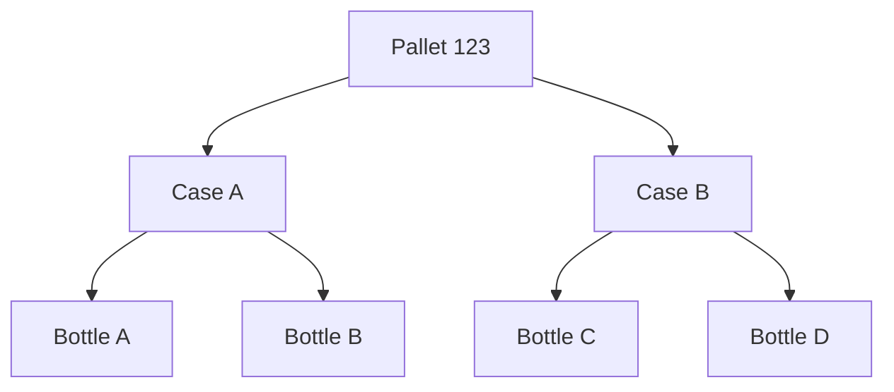

# Axis ⚡


````md
A modern TypeScript SDK for EPCIS, GS1 identifiers, and traceability applications.

**Axis is a framework for building traceability software—not just another EPCIS parser.**

Axis helps developers build serialization, inventory management, supply chain visibility, product intelligence, and recall management software without starting from raw EPCIS XML.

Instead of forcing developers to work directly with XML nodes, Axis provides strongly typed TypeScript objects for EPCIS documents, events, identifiers, inventory, genealogy, and application development.

```bash
npm install @buildonaxis/core
````

```
```


---

# Why Axis?

Most EPCIS tooling focuses on XML generation and parsing.

Axis focuses on the application layer.

Developers should be able to work with:

```ts
const shipment = new Shipment(...);
const item = SerializedItem.fromBarcode(...);
const graph = document.buildTraceGraph();
```

instead of:

```xml
<ObjectEvent>
  ...
</ObjectEvent>
```

Axis transforms EPCIS data into a developer-friendly domain model that can be queried, validated, visualized, and extended.

---

# Features

## EPCIS Domain Model

Create and manipulate EPCIS events using TypeScript objects.

Supported event types:

- Object Events
- Aggregation Events
- Transformation Events
- Transaction Events
- Association Events

---

## GS1 Identifier Support

Work with:

- GTIN
- GLN
- SSCC
- Serialized Items
- Lot-Tracked Items

Parse identifiers directly from GS1 barcode strings.

```ts
const item = SerializedItem.fromBarcode(
  "01000312345678901726123121ABC123"
);
```

---

## EPCIS Generation

Generate EPCIS documents programmatically.

```ts
const document = new EpcisDocument({
  body: new EpcisBody({
    events: [...]
  })
});
```

Export as:

```ts
document.toJSON();

XmlWriter.write(document);
```

---

## EPCIS Parsing

Convert XML into application-ready objects.

```ts
const document = XmlParser.parse(xml);
```

Then immediately query:

```ts
document.stats();

document.allEpcs();

document.eventsByBizStep("shipping");
```

---

## Traceability Graphs

Build product genealogy and relationship graphs from EPCIS data.

```ts
const graph = document.buildTraceGraph();
```

Generate:

```ts
graph.toJSON();

graph.toMermaid();
```

Produces:



---

````md
## Inventory APIs

Reconstruct serialized inventory directly from EPCIS Aggregation Events.

```ts
const inventory = InventorySnapshot.fromDocument(document);

inventory.statistics();

inventory.rootContainers();

inventory.containerView(pallet);

inventory.record(item);

inventory.hierarchy();
````

Built-in capabilities include:

* Inventory reconstruction
* Parent / child relationships
* Root container discovery
* Inventory statistics
* Container views
* Inventory hierarchy
* Relationship exports
* Tabular inventory views

---

## Validation

A comprehensive validation framework is planned for an upcoming release.

Future capabilities include:

* EPCIS document validation
* GS1 compliance rules
* Custom validation profiles
* Regulatory validation packs

```
```


---

# Quick Start

## Parse a GS1 Barcode

```ts
import {
  SerializedItem
} from "@buildonaxis/core";

const item = SerializedItem.fromBarcode(
  "01000312345678901726123121ABC123"
);

console.log(item.toJSON());
```

Output:

```js
{
  gtin: "00031234567890",
  serial: "ABC123",
  expiration: "2026-12-31"
}
```

---

## Generate EPCIS

```ts
const document = new EpcisDocument({
  body: new EpcisBody({
    events: [...]
  })
});

const xml = XmlWriter.write(document);
```

---

## Parse EPCIS

```ts
const document = XmlParser.parse(xml);

console.log(document.stats());

console.log(document.allEpcs());
```

---

## Build a Traceability Graph

```ts
const graph = document.buildTraceGraph();

console.log(graph.toMermaid());
```

---

# Examples

Axis includes several runnable examples.

```md
| Example | Description |
|----------|-------------|
| [Barcode Parsing](./examples/barcode-parsing) | Parse GS1 barcodes and identifiers |
| [Generate EPCIS](./examples/generate-epcis) | Generate EPCIS JSON and XML |
| [Inventory Reconstruction](./examples/inventory) | Build serialized inventory from Aggregation Events |
| [Parse EPCIS](./examples/parse-epcis) | Convert EPCIS XML into domain objects |
| [Product Genealogy](./examples/product-genealogy) | Build product relationship graphs |
| [Recall Analysis](./examples/recall-analysis) | Perform genealogy and impact analysis |
```


---

# What Can You Build With Axis?

Axis is designed as a foundation for traceability applications.

Examples include:

### Serialization Systems

- Product commissioning
- Packaging workflows
- Aggregation management

### Inventory Systems

- Serialized inventory
- Lot-tracked inventory
- Warehouse operations

### Product Intelligence

- Product genealogy
- Product history
- Product movement analysis

### Recall Management

- Impact analysis
- Containment analysis
- Investigation workflows

### Supply Chain Applications

- Shipment visibility
- Partner integrations
- Event monitoring

### Analytics Platforms

- EPCIS reporting
- Event aggregation
- Relationship analysis
- Traceability dashboards

---

````md
# Architecture

```text
GS1 Barcodes
       │
       ▼
Identifiers
       │
       ▼
EPCIS Events
       │
       ▼
EPCIS Documents
       │
       ├──────────────┐
       ▼              ▼
Inventory        Genealogy
       │              │
       └──────┬───────┘
              ▼
     Traceability Applications
````

Axis provides the application layer between raw EPCIS data and production software.

```
```


---

# Design Philosophy

### EPCIS First

Axis models EPCIS concepts directly.

Developers work with events and documents rather than XML structures.

### TypeScript First

Strong typing improves developer experience and reduces implementation errors.

### Application Focused

Axis is designed for building software applications, not simply generating XML.

### Framework Agnostic

Use Axis with:

- Node.js
- React
- Next.js
- Express
- NestJS
- Electron
- Serverless Platforms

---

```md
# Roadmap

## Available Today

- ✅ EPCIS Domain Model
- ✅ EPCIS Parsing
- ✅ EPCIS Generation
- ✅ GS1 Identifier Support
- ✅ Inventory Reconstruction
- ✅ Inventory Query APIs
- ✅ Inventory Hierarchy
- ✅ Traceability Graphs

## Coming Next

- Validation Framework
- Advanced Validation Profiles
- Digital Link Support
- Master Data APIs
- Graph Visualization Components
- Traceability Analytics
- Partner Integration Helpers
```

---

# Learn More

- Documentation (coming soon)
- Examples (`/examples`)
- GitHub Issues
- GitHub Discussions

---

# Contributing

Contributions, ideas, bug reports, and feedback are welcome.

Please open an issue before submitting large changes.

---

# License

MIT License