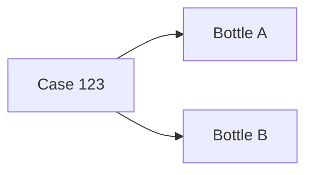

# Generate EPCIS Document Example

This example shows how to use Axis to generate an EPCIS document from TypeScript objects.

It demonstrates how developers can create traceability events in code and export them as EPCIS JSON and EPCIS XML.

---

## Run

```bash
npm install
npm start
```

---

## Scenario

This example models a simple packaging and shipping workflow:



The workflow includes:

- Commissioning serialized items
- Packing bottles into a case
- Shipping the case
- Validating the document
- Exporting EPCIS JSON
- Exporting EPCIS XML

---

## Example

```js
const document = new EpcisDocument({
  body: new EpcisBody({
    events: [
      createCommissioningEvent({
        items: [caseItem, bottleA, bottleB],
        location: warehouse
      }),
      createPackingEvent({
        parent: caseItem,
        children: [bottleA, bottleB],
        location: warehouse
      }),
      createShippingEvent({
        items: [caseItem],
        location: warehouse
      })
    ]
  })
});
```

Generate XML:

```js
const xml = XmlWriter.write(document);
```

---

## Why This Matters

Many traceability applications need to create EPCIS data from operational activity.

Axis lets developers build those events using TypeScript domain objects instead of manually constructing XML.

This makes EPCIS generation easier to test, validate, and integrate into applications.