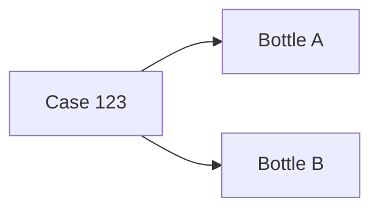

# Parse EPCIS Document Example

This example shows how to use Axis to parse EPCIS XML into application-ready TypeScript objects.

It demonstrates how developers can ingest EPCIS data, inspect events, discover EPCs, validate the document, and build a traceability graph.

---

## Run

```bash
npm install
npm start
```

---

## Scenario

This example starts with EPCIS XML that contains:

- A commissioning event
- A packing aggregation event
- A shipping event



Axis parses the XML into a document object that can be queried and analyzed.

---

## Example

```js
import {
  XmlParser,
  validateDocument
} from "@buildonaxis/core";

const document = XmlParser.parse(xml);

console.log(document.stats());

console.log(validateDocument(document));

console.log(document.allEpcs().toArray());

console.log(
  document.eventsByBizStep("shipping")
);

const graph = document.buildTraceGraph();

console.log(graph.toMermaid());
```

---

## Why This Matters

Many traceability applications begin with existing EPCIS data.

Axis lets developers parse EPCIS XML and immediately work with:

- Domain objects
- Event queries
- EPC discovery
- Validation results
- Traceability graphs

Instead of manually traversing XML, developers can work with an application-level model.