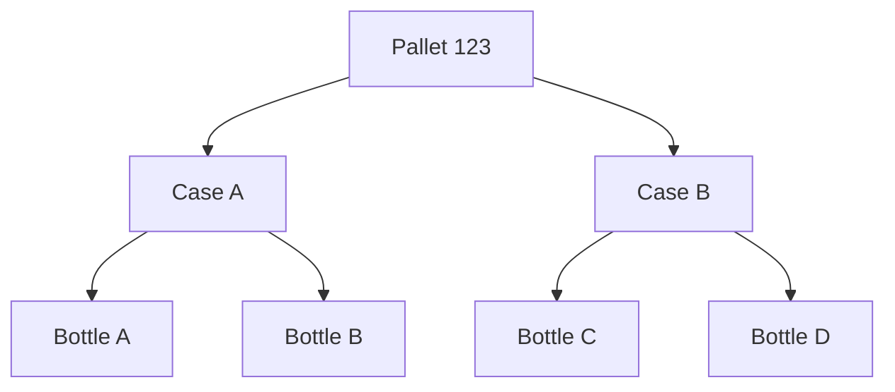

# Recall Analysis Example

This example shows how Axis can support recall and investigation workflows using traceability graphs.

It demonstrates how developers can start with EPCIS-style events and answer relationship-based questions such as:

- What contains this product?
- What shipment unit was this product packed into?
- If a case is affected, what products are impacted?
- If a pallet is affected, what products are impacted?

---

## Run

```bash
npm install
npm start
```

---

## Scenario

A pallet contains two cases. Each case contains two bottles.



Bottle B is flagged for investigation.

Axis uses the traceability graph to determine:

```text
Bottle B
  ↑
Case A
  ↑
Pallet 123
```

---

## Example Questions

### What contains Bottle B?

```js
graph.ancestors(bottleBEpc);
```

### What is the path from the pallet to Bottle B?

```js
graph.path(palletEpc, bottleBEpc);
```

### If Case A is affected, what products are impacted?

```js
graph.descendants(caseAEpc);
```

### If the full pallet is affected, what products are impacted?

```js
graph.descendants(palletEpc);
```

---

## Why This Matters

Traceability applications are rarely only about storing events.

They need to answer questions about impact, containment, genealogy, and product relationships.

Axis turns EPCIS events into a graph that developers can query directly.

That graph can support:

- Recall analysis
- Product investigation
- Inventory impact analysis
- Product genealogy
- Supply chain visibility
- Exception management

---

## Notes

This example is intentionally focused on traceability relationships.

It is not a complete recall management application. Production systems may also need user workflows, regulatory rules, partner data, notifications, audit trails, and case management.

Axis provides the traceability foundation those applications can build on.